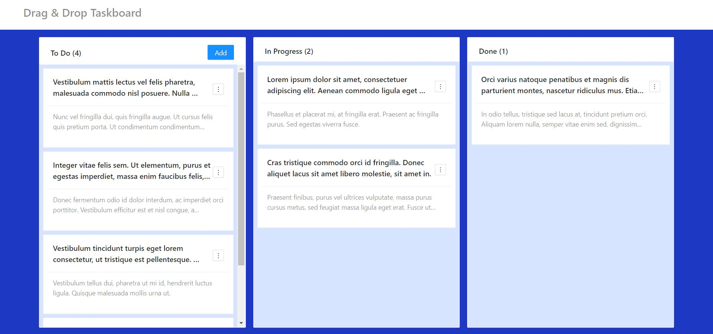

# Drag & Drop Taskboard

A taskboard application with drag and drop feature. 

## Features

🖋 Create, edit & delete tasks  
☝ Change task order and status by drag & drop  
💾 Tasks are persisted to localStorage  
🔃 Sync between tabs  
🚀 Automated deployments with GitHub Actions  

## Development
### `npm start`

Runs the app in the development mode

The page will reload if you make edits.\
You will also see any lint errors in the console.

### `npm run build`

Builds the app for production to the `build` folder.\

